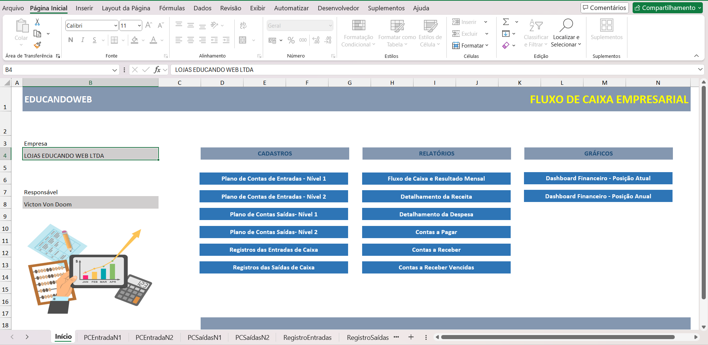
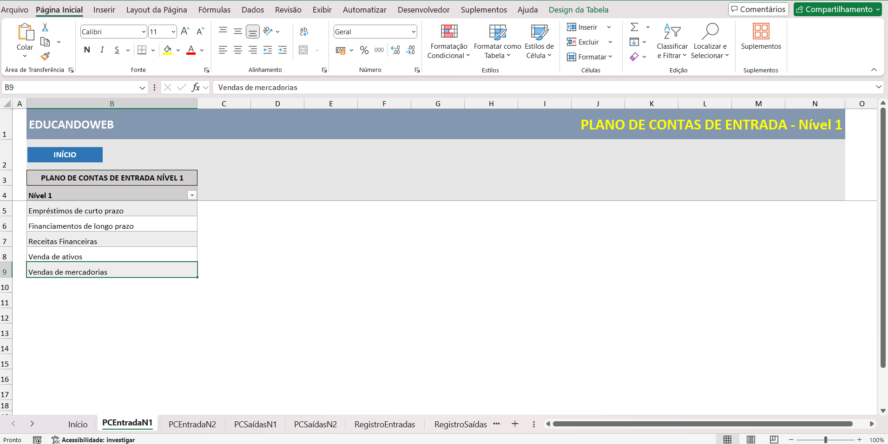
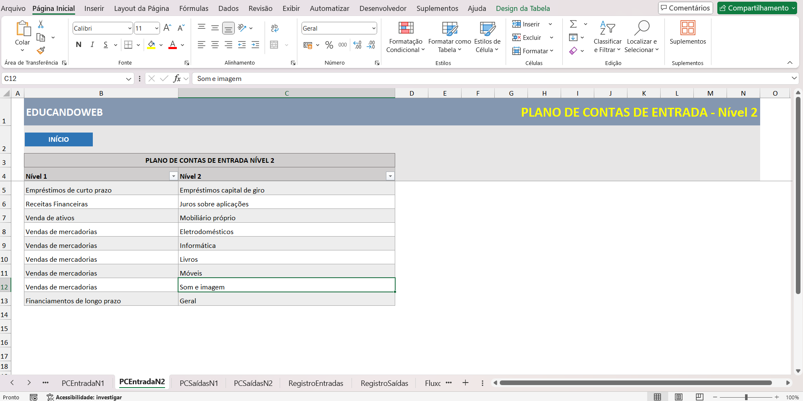
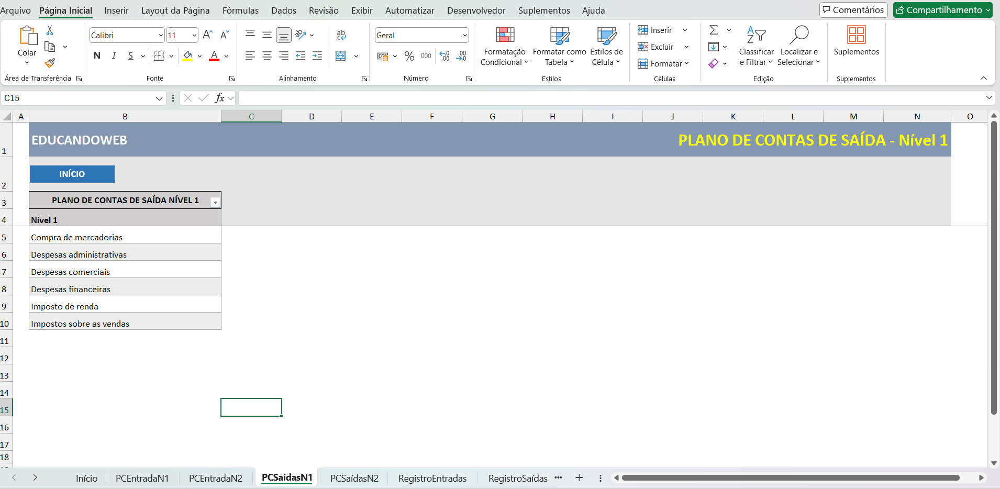
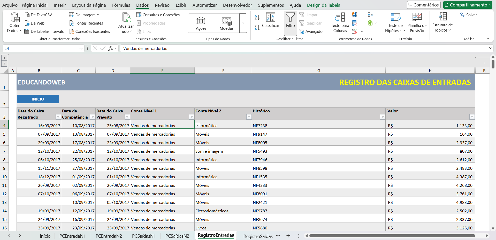
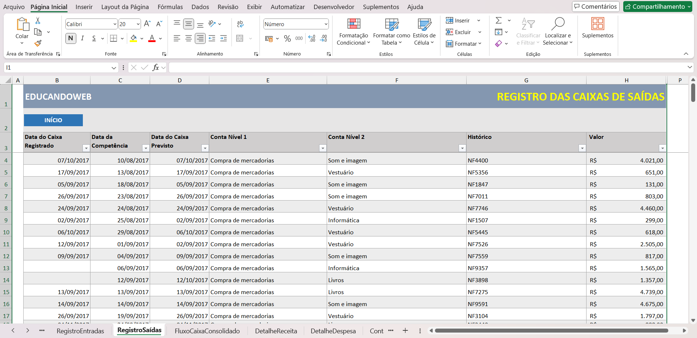
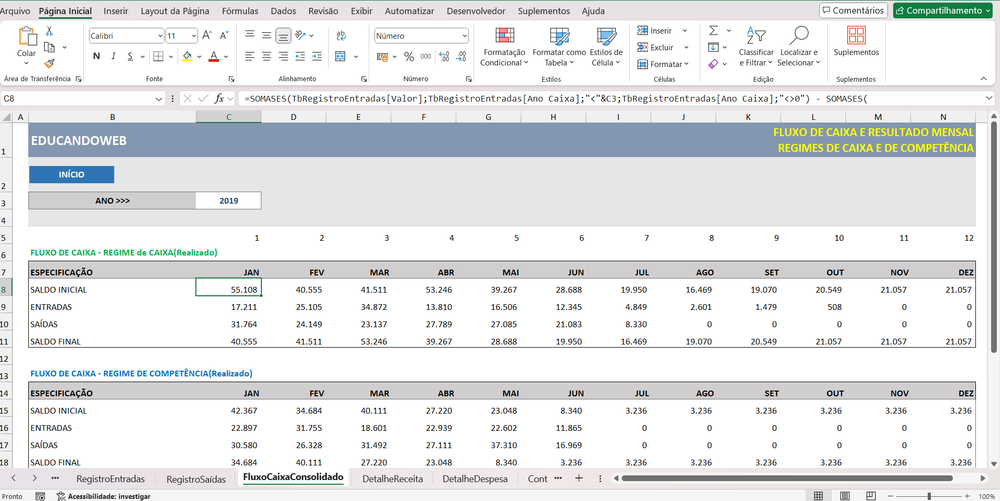
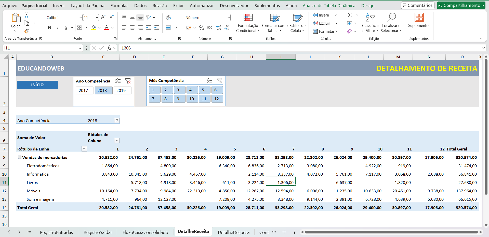

O projeto 1 consistia em desenvolver uma planilha que permitesse o cadastro de entradas e saídas de caixa, gerar relatórios relacionados aos dados e dois dashboard interativos, um por ano e outro por data.
### Menu:

Menu criado para facilitar a navegação na planilha.

### Cadastro de Entradas Nível 1:

Planilha para realizar o cadastro de entrada nível 1, este cadastro será utilizado para validar registros de entrada.

### Cadastro de Entradas Nível 2

Planilha para realizar o cadastro de entrada nível 2, este cadastro será utilizado para validar registros de entrada, verificando a existência do cadastro e se ele está devidamente associado ao Nível 1.

### Cadastro de Saídas Nível 1:
 
Planilha para realizar o cadastro de saídas nível 1, este cadastro será utilizado para validar registros de saída.

### Cadastro de Saídas Nível 2:

Planilha para realizar o cadastro de saídas nível 2, este cadastro será utilizado para validar registros de saídas, verificando a existência do cadastro e se ele está devidamente associado ao Nível 1.

 
 ### Registro de Entradas
 
 Planilha utilizada para o usuário realizar entradas. Nesta planilha foram realizadas as seguintes ações:
 1) Validação de dados 
 
 - Para validar os dados, a coluna conta Nível 1 possui um critério de validação de listas "=PCEntradasN1_Nível_1". Permitindo apenas que dados previmente cadastrados sejam aceitos.

- A coluna conta Nível 2 também possui um critério de validação de listas. "=DESLOC(PCEntradasN2_Nível_2; CORRESP(E4; PCEntradasN2_Nível_1; 0)-1; 0; CONT.SE(PCEntradasN2_Nível_1; E4))" Esta fórmula garante que possa ser cadastrado apenas itens registrados anteriormente no nível correspondente.

 2) Construção de colunas auxiliares
 Colunas auxiliares foram construidas para auxiliar nas ánalises e ocultadas para a análise.

 - Mês Caixa: Extrai o mês da data do caixa.
 - Ano Caixa: Extrai o ano da data do caixa.
 - Mês Competência: Extrai o mês da data da competência.
 - Ano Competência: Extrai o ano da data de competência.
 - Mês Previsto: Extrai o mês da data prevista.
 - Ano Previsto: Extrai o ano da data prevista.
 - Conta Vencida: Tem como objetivo verificar se a conta está vencida. Utiliza a fórmula "=SE(E([@[Data do Caixa Registrado]]="";[@[Data do Caixa Previsto]] < HOJE());"Vencida";"Não Vencida")".
 - Venda à vista: Tem como objetivo verificar se o pagamento foi a vista ou a prazo. =SE([@[Data da Competência]]=[@[Data do Caixa Previsto]];"Vista";"Prazo")
- Dias de Atraso: Verificar a quantidade de dias de atraso caso exista:
"=SE([@[Data do Caixa Registrado]]<>"";SE([@[Data do Caixa Registrado]]>[@[Data do Caixa Previsto]];[@[Data do Caixa Registrado]]-[@[Data do Caixa Previsto]];0);SE(HOJE()>[@[Data do Caixa Previsto]];HOJE()-[@[Data do Caixa Previsto]];0))"

### Registro de Saídas

Esta planilha segue a mesma lógica que a anterior, mas adaptando para as saídas. Possui validação de dados e colunas auxiliares bem semelhantes a planilha anterior.

### Fluxo Caixa Consolidado

Esta planilha tem como objetivo realizar os cálculos de fluxo de caixa (Competência e Caixa) e o resultado mensal da competência. Os calculos são feitos de acordo com o ano fornecido na célula C3.

### Detalhe Receita

Uma tabela dinâmica foi criada para realizar a análise de receita. É possível filtrar por ano e mês de competência.

A tabela é composta da seguinte forma:
- Filtro:Ano Competência
- Coluna: Mês Competência
- Linhas: Conta Nível 1 e Conta Nível 2
- Valores: Soma de valores